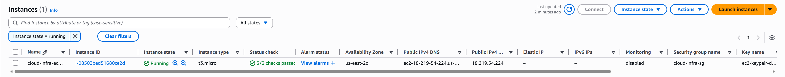
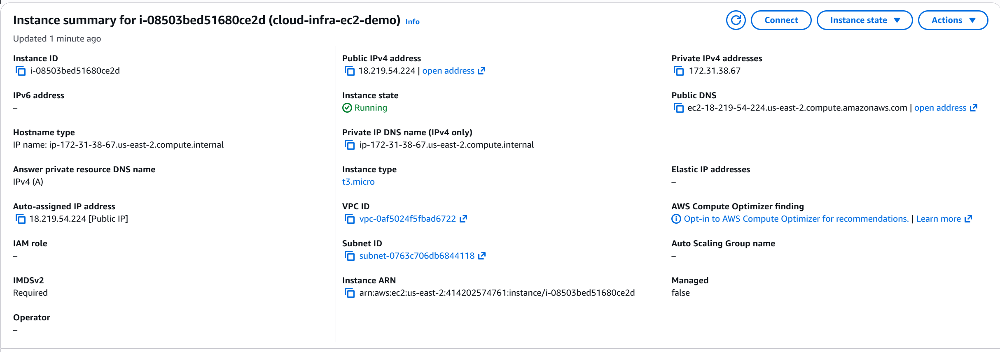
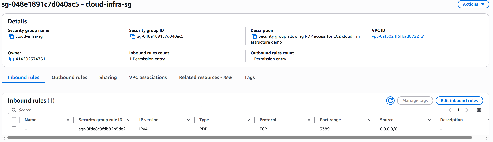
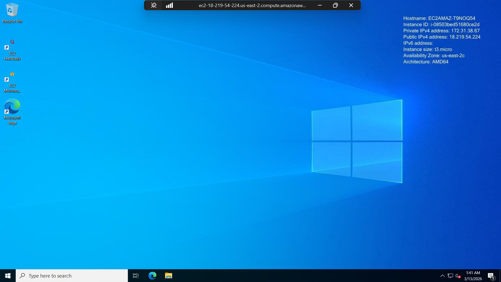

# AWS Cloud Infrastructure Deployment

## Project Overview
This project demonstrates the deployment and configuration of AWS EC2 cloud infrastructure using a Windows Server instance. The project includes instance provisioning, security group configuration for Remote Desktop Protocol (RDP), and successful remote access to the server.

## Technologies and Services Used
- Amazon EC2
- AWS Security Groups
- Amazon VPC (default networking)
- Windows Server 2022
- Remote Desktop Protocol (RDP)

## Objectives
- Provision a cloud-based virtual machine in AWS
- Configure secure remote access using RDP
- Review and validate core infrastructure details such as public IP, VPC, and subnet
- Practice foundational cloud infrastructure deployment skills

## Deployment Summary
An EC2 instance was launched in AWS using a free-tier eligible instance type. A security group was created to allow RDP access over port 3389, and the instance was successfully accessed remotely through Microsoft Remote Desktop.

## Skills Demonstrated
- EC2 instance provisioning
- Security group configuration
- Key pair management
- Remote server access
- Basic cloud networking concepts
- Infrastructure validation and documentation

## Architecture

The diagram below illustrates the architecture used in this project. A user connects to the AWS EC2 Windows Server instance using Remote Desktop Protocol (RDP). Access to the instance is controlled through an AWS Security Group that allows inbound traffic on port 3389.

## Screenshots

### 1. EC2 Instance Running
Shows the deployed EC2 instance in a running state with instance details visible.

### 2. EC2 Instance Details
Shows the instance summary including public IP address, instance type, VPC, subnet, and DNS details.

### 3. Security Group Rules
Shows the inbound security rule allowing RDP access on port 3389.

### 4. Remote Desktop Connection
Shows successful RDP access to the Windows Server instance.

## Outcome
This project demonstrates foundational AWS cloud infrastructure skills, including compute provisioning, access control configuration, and remote system administration.

## Future Improvements
Potential enhancements to this infrastructure include:

- deploying multiple EC2 instances behind a load balancer
- implementing auto scaling for high availability
- automating infrastructure deployment using Terraform or AWS CloudFormation
- configuring monitoring using Amazon CloudWatch
